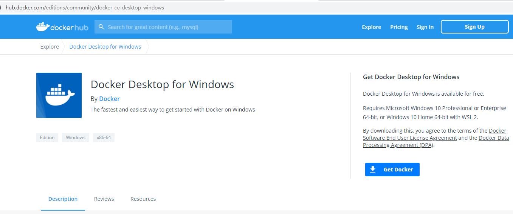
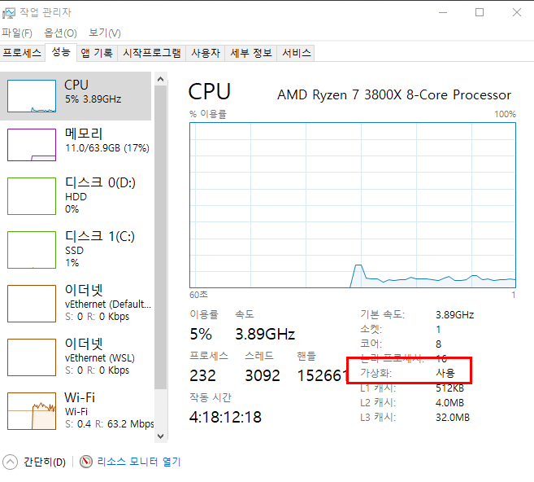
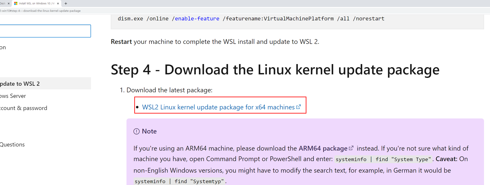
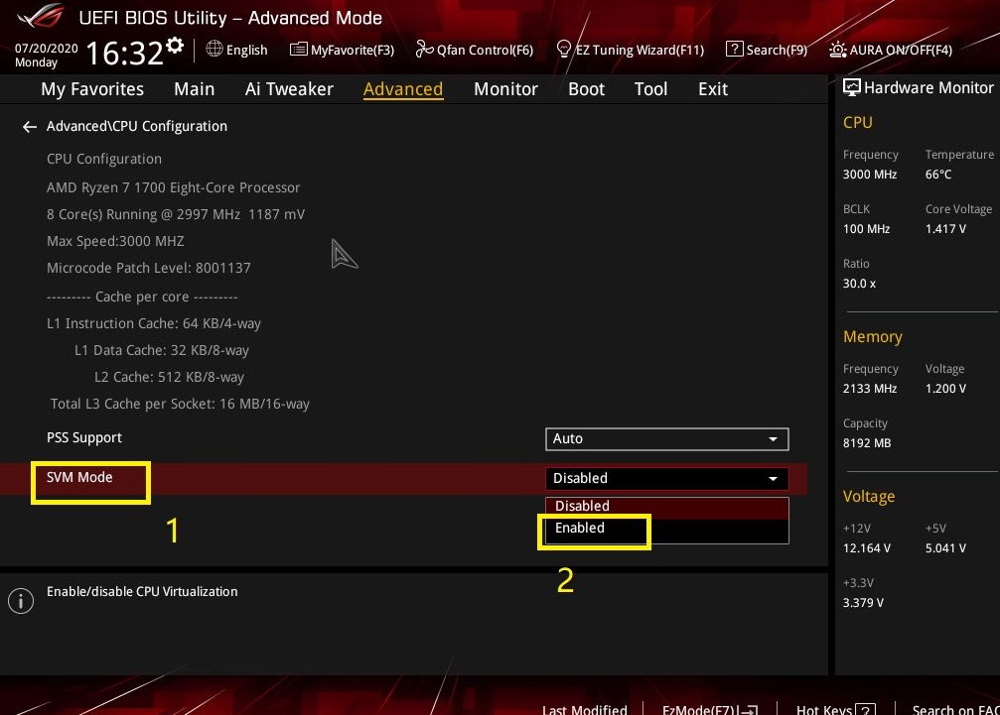

# 1. CI/CD 구축을 위한 환경설정
## 1-1 DOCKER 설치
#### i) CI/CD 구동을 위한 CentOS 8을 설치하기 위하여 __Docker DeskTop for Window__ 설치  
  

&nbsp;[그림1]&nbsp;아래 그림에서 __Get Docker__ 를 클릭한다.  
  
#### ii) 관리자의 가상화 부분 true로 변경

#### iii) 관리자의 가상화 부분 true로 변경 방법
  제어판 > 프로그램 설치 및 제거 > Window 기능 켜기/끄기 클릭 > Hyper-V 체크 확인 후 리부팅  (이문제 아니었다 이건 끄고도 되는지 다시해보자)
  
#### iv) Docker DeskTop for Window 실행 시 WSL 2 installation is incomplete. 이 에러 발생하면
  WSL2 Linux kernel update package for x64 machines 설치

#### v) Bios 가상화 가능하도록 셋업 (BIOS 진입을 위하여 컴퓨터 부팅 중 F2 또는 Delete 버튼 누름) 

